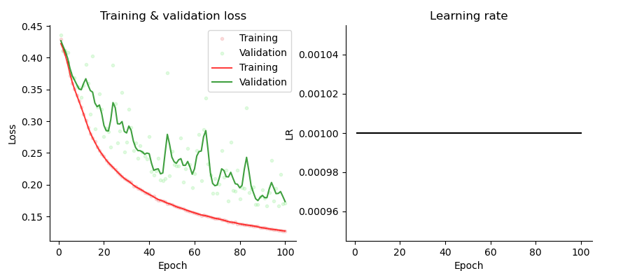
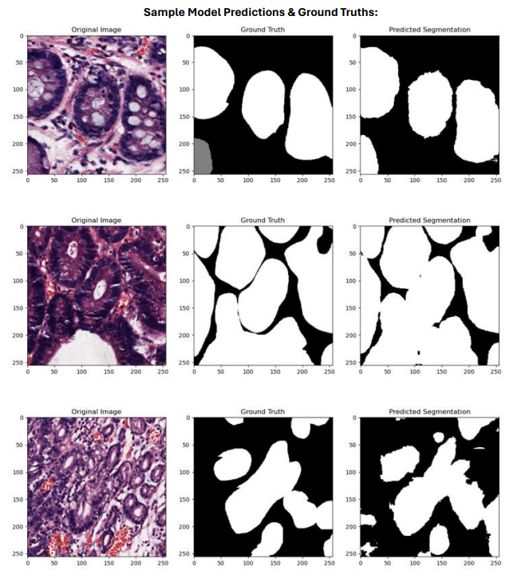

## Semantic Segmentation of Glands

This repository explores various SOTA deep learning models for semantic segmentation of a histopathological dataset of glands. The project is done for a higher level undergrad special topics course in Computer Vision in the American University of Sharjah.

Models explored include:
- UNet
- DeepLab
- SwinUNetR
- UNetR
- SegFormer

The best performing model was the classic UNet architecture with the follwing metrics:

- Avg F1-score: 92.6%
- AVG DICE Coeff.: 92.6%
- IoU: 86.2%
- Precision: 92.3%
- Recall: 93.1%
- Sensitivity: 93.1%
- Specificity: 96.2%


The training vs validation loss curve is shown below:



Some sample predictions and the ground truth are shown below:


## Dataset Description:

Pixel Classes:

- 0 - Background Tumour
- 1 - Malignant Tumour
- 2 - Benign Tumour

Original dataset link: https://ieee-dataport.org/documents/pathological-images-gland-segmentation#files

## Methodology:
1. Employ image preprocessing techniques (resize, balance,etc. see section below for more details)
2. Construct Dataset class and create DataLoaders
3. Build Model
3. Train model for ~60 epochs
4. Save training vs validation loss graph
5. Compute inference metrics - Dice, F1 score (avg. and classwise), IoU
6. Save sample predictions


## Dataset Pre-processing:
The class distribution of the pixels are heavily imablanced
- Class 0 - 7 million
- Class 1 - 2 million
- Class 2 - 2 million

In order to account for this heavy class imbalance, 2 main strategies were employed.
1. Due to the large number of class 0 instances, all images with only class 0 were removed
2. Instead of traditional loss functions, we explored the use of Focal Loss, Focal Tversky Loss and Dice Loss.

After training the model across different loss functions, Focal Loss was shown to give the best generalizability on the test set.

Finally, due to the large variation in image size distributions, all images were resized to 256x256.

## Instructions:

As the dataset is extremely large (~22 thousand images), a sample dataset has been included in this repository. 
Simply enter the directory of the model you would like to train or test.

``` Bash
#For training:
python3 trainmodel.py

#For testing:
python3 predict.py
```

The train script will generate a training vs validation plot that can be analysed to identify any under/over fitting

The test script outputs the class wise F1 scores, Precision, Recall, Dice Coeff., and IoU.
A predictions.png is also saved to the directory that helps comparethe original image, ground truth mask, and predicted mask.

To train the model on the original and complete dataset, simply download the dataset into the root directory and run the preprocessing scripts.
Then follow the exact same instructions as provided above for the sample dataset.

